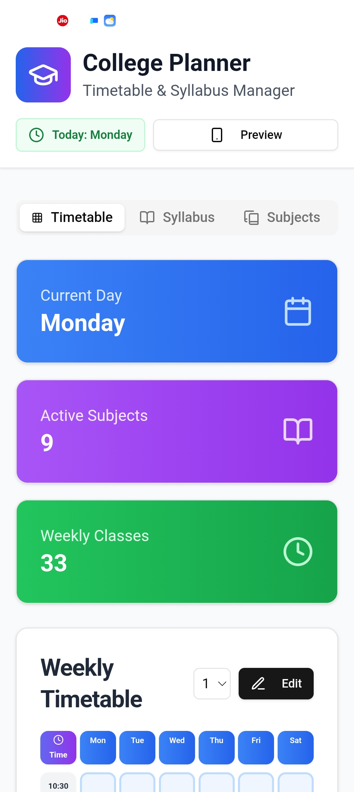
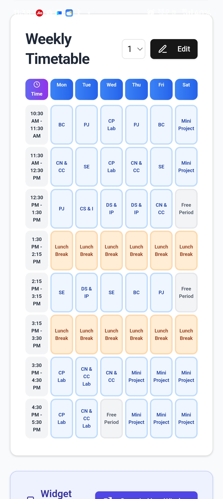
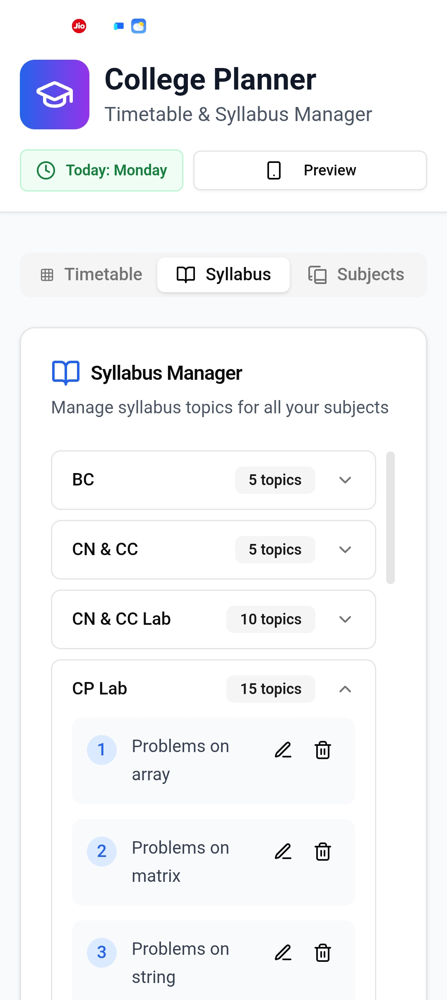
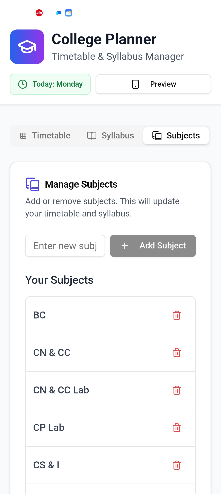
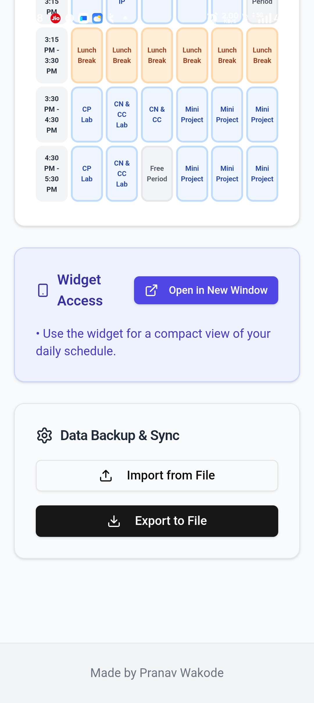
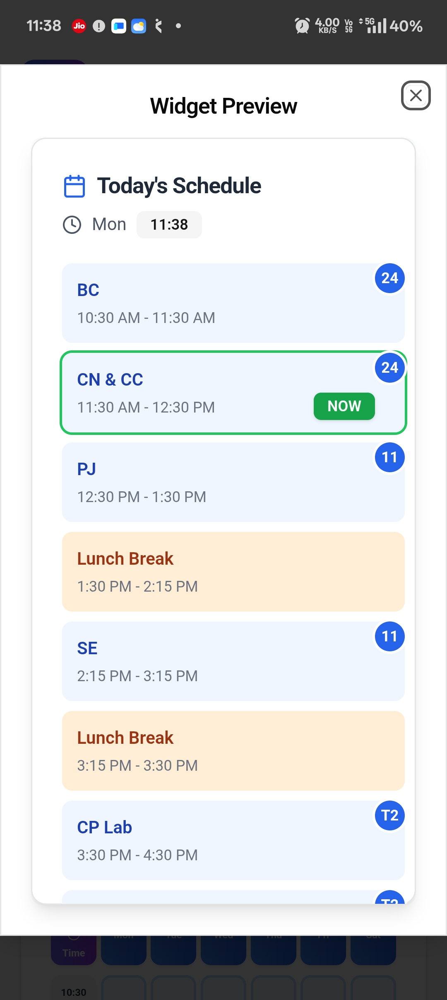
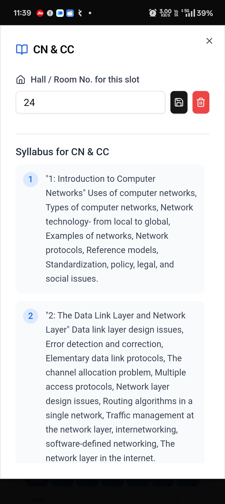

# 🎓 College Planner - Timetable & Syllabus Manager
College Planner is a complete Android application built to help students effortlessly manage their academic life. It combines a weekly timetable, a detailed syllabus tracker, and an intelligent home screen widget into one offline-first package. Built with React and Capacitor, it's designed to be fast, intuitive, and reliable.

## ✨ Core Features

### 🗓️ Timetable Section
- **Today View:** A dashboard that shows the current day, total active subjects, and the number of classes for the week.
- **Weekly Timetable Grid:** A clear, editable grid displaying your schedule from Monday to Saturday.
- **Customizable Timeslots:** Easily edit the start and end times for your lecture slots to match your college's schedule.
- **Syllabus Integration:** Tap on any subject directly from the timetable to view its syllabus, add, update or delete syllabus for that specific class.

<p align="center">
  
  &nbsp;&nbsp;&nbsp;&nbsp;&nbsp;&nbsp;
</p>

### 📚 Syllabus Section
- **Centralized Management:** View all your subjects and their corresponding syllabus topics in one place.
- **CRUD Operations:** Easily Add, Edit, and Delete syllabus points for any subject to keep track of your progress.
- **Expandable Views:** Each subject is presented in a clean, expandable accordion view to avoid clutter.

<p align="center">
  
</p>

### 📝 Subjects Section
- **Master Subject List:** This is the source of truth for your subjects. Add or delete subjects here, and the changes will reflect instantly across the timetable and syllabus sections.
- **Simple Interface:** A straightforward list allows for quick additions and deletions.

<p align="center">
  
</p>

### 🔄 Data Backup and Sync
- **Export Data:** Save your entire timetable, subjects, and syllabus to a local JSON file. Keep it as a backup or share it with friends.
- **Import Data:** Restore your data from an exported file in seconds. Perfect for new device setups or after a reset.

<p align="center">
  
</p>

## 📱 Android Home Screen Widget
The widget brings your daily schedule directly to your home screen for quick glances.
- **Today's Schedule:** Clearly displays all of today's classes with their timings.
- **Live "NOW" Badge:** A green "NOW" badge automatically appears next to the currently active lecture, updating throughout the day.
- **Hall Number Indicator:** A notification-style bubble at the top-right of each subject shows the assigned Hall or Room number.
- **Instant Syllabus Access:** Tap on any subject in the widget to open the app and view its details, including syllabus points and the option to edit the hall number.

<p align="center">
  
  &nbsp;&nbsp;&nbsp;&nbsp;&nbsp;&nbsp;
</p>

## 🛠️ Tech Stack
- **Frontend:** React.js
- **Mobile Framework:** Capacitor.js
- **UI/Styling:** Tailwind CSS, shadcn/ui
- **Backend (Optional):** Python, Flask
- **Platform:** Android

## 🚀 Getting Started & Build Instructions
Follow these steps to build and run the project on your local machine.
**Prerequisites**
- Node.js & Yarn
- Java JDK 11 or higher
- Android Studio & Android SDK

### Build Steps
1. **Clone the repository:**

```bash
git clone [https://github.com/wakodepranav2005-git/college_planner.git](https://github.com/wakodepranav2005-git/college_planner.git)
cd college_planner/frontend
```

2. **Install dependencies:**

```bash
yarn install
```

3. **Build the React app:**

```bash
yarn build
```

4. **Sync with Capacitor:**

```bash
npx cap sync android
```

5. **Open in Android Studio:**

```bash
npx cap open android
```

- Once open, allow Gradle to sync. You can then run the app on an emulator or a connected physical device.

6. **Build APK from Command Line:**

```bash
# Navigate to the android directory
cd android
# Build the debug APK
./gradlew assembleDebug
```

- The APK will be located at frontend/android/app/build/outputs/apk/debug/app-debug.apk.

## 👨‍💻 Author
**Pranav Wakode**